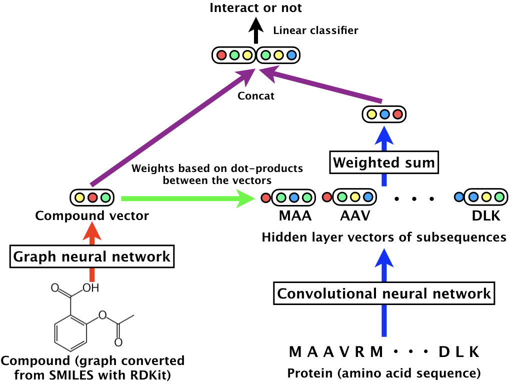
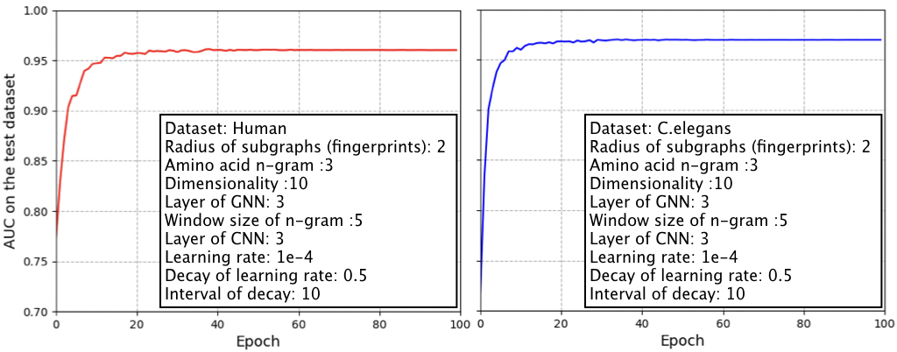

# Compound-protein interaction (CPI) prediction using a GNN for compounds and a CNN for proteins

This code is a simpler model and its faster implementation of our paper
"[Compound-protein Interaction Prediction with End-to-end Learning of Neural Networks for Graphs and Sequences (Bioinformatics, 2018)](https://academic.oup.com/bioinformatics/advance-article-abstract/doi/10.1093/bioinformatics/bty535/5050020?redirectedFrom=PDF)" in PyTorch.
In this code, we prepare two CPI datasets of human and *C. elegans* provided in
"[Improving compound–protein interaction prediction by building up highly credible negative samples (Bioinformatics, 2015).](https://academic.oup.com/bioinformatics/article/31/12/i221/216307)"
Note that the ratio of positive and negative samples is 1:1.

In our problem setting of CPI prediction,
an input is the pair of a SMILES (compound) and an amino acid sequence (protein);
an output is a binary label (interact or not).
The SMILES is converted with RDKit and
we obtain a 2D graph-structured data of the compound (i.e., atom types and its adjacency matrix).
The overview of our CPI prediction approach is as follows:

<div align="center">
<p></p>
</div>

The details of the above model are described in our paper.

Note that, in our paper we propose a graph neural network (GNN) for molecules,
which is based on learning representations of r-radius subgraphs (i.e., fingerprints) in molecules.
The details of our GNN and its implementation for predicting various molecular properties
are provided in https://github.com/masashitsubaki/GNN_molecules.


## Characteristics

- This code is easy-to-use.
After setting the environment (e.g., PyTorch),
preprocessing CPI data and learning a model can be done by only two commands (see "Usage").
- If you prepare a dataset with the same format as provided in the dataset directory,
you can learn our model with your dataset by the two commands
(see "Training of our neural network using your CPI dataset").


## Requirements

- PyTorch (version 0.4.0)
- scikit-learn
- RDKit


## Usage

We provide two major scripts:

- code/preprocess_data.py creates the input tensor data of compound-protein interactions (CPIs)
for processing with PyTorch from the original data (see dataset/human or celegans/original/smiles_sequence_interaction.txt).
- code/run_training.py trains our neural network
using the above preprocessed data (see dataset/human or celegans/input).

(i) Create the tensor data of CPIs with the following command:
```
cd code
bash preprocess_data.sh
```

(ii) Using the preprocessed data, train our neural network with the following command:
```
bash run_training.sh
```

The training result and trained model are saved in the output directory
(after training, see output/result and output/model).

(iii) You can change the hyperparameters in preprocess_data.sh and run_training.sh (see these scripts).
Try to learn various models.


## Result

Learning curves (x-axis is epoch and y-axis is AUC) on the test datasets of human and *C. elegans* are as follows:

<div align="center">
<p></p>
</div>

These results can be reproduce by the above two commands.


## Training of our neural network using your CPI dataset
In the directory of dataset/human or celegans/original,
we now have the original data "smiles_sequence_interaction.txt" as follows:

```
CC[C@@]...OC)O MSPLNQ...KAS 0
C1C...O1 MSTSSL...FLL 1
CCCC(=O)...CC=C1 MAGAGP...QET 0
...
...
...
CC...C MKGNST...FVS 0
C(C...O)N MSPSPT...LCS 1
```

Note that 1 means "the pair of SMILES and sequence has interaction" and 0 means "does not have interaction."
If you prepare dataset with the same format in a new directory (e.g., dataset/yourdata/original),
you can train our neural network using your dataset by the above two commands (i) and (ii).


## TODO

- Provide a pre-trained model with a large dataset.


## How to cite

```
@article{tsubaki2018compound,
  title={Compound-protein Interaction Prediction with End-to-end Learning of Neural Networks for Graphs and Sequences},
  author={Tsubaki, Masashi and Tomii, Kentaro and Sese, Jun},
  journal={Bioinformatics},
  year={2018}
}
```
